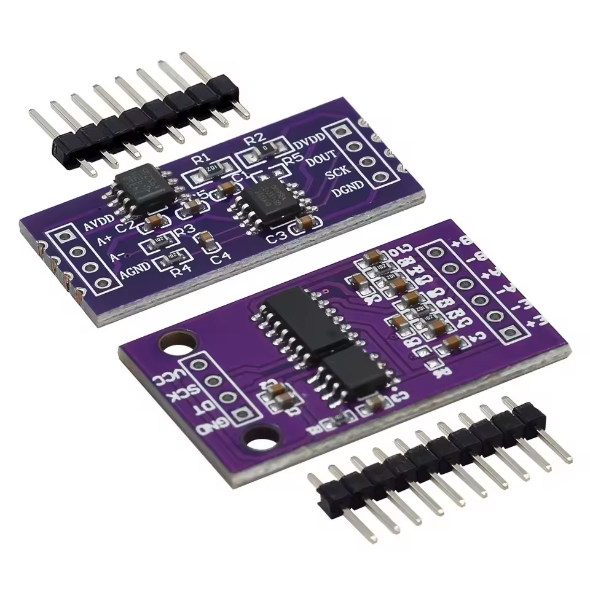

# CS123x

Arduino library for Chipsea [CS1237](https://en.chipsea.com/product/details/?id=1155&pid=77) and [CS1238](https://en.chipsea.com/product/details/?id=1156&pid=77) 24-bit ADCs. Designed for weight scales, load cells, and bridge sensors with full PGA, data rate, scale calibration, and internal temperature control.

### Motivation

This library was born out of a real-world engineering challenge: capturing **high-speed dynamic weight measurements** using standard load cells. 

Popular ADC chips like the HX711 are hard-capped at 80 SPS, making them far too slow for tracking rapid weight transitions, impact forces, or high-speed industrial control loops. While the Chipsea CS123x family natively supports sampling rates up to **1280 Hz**, there was a distinct lack of robust, production-grade, and well-documented C++ drivers available for the Arduino ecosystem.

This library bridges that gap — offering a reliable, fully-configurable, and thoroughly documented interface for high-performance weight sensing and precision data acquisition.

### Why CS123x over HX711?
While the widely used HX711 is restricted to 10 Hz / 80 Hz data rates and ties PGA gains strictly to fixed channel inputs, the CS123x family offers significantly higher performance and diagnostic flexibility:

* **Superior Sampling Speed:** Configurable output data rates up to **1280 Hz** (10, 40, 640, 1280 Hz) compared to the HX711's 80 Hz limit, making it ideal for dynamic weighing and fast control loops.
* **Unrestricted Channel & Gain Mapping:** Independently select PGA gain (1x, 2x, 64x, 128x) on any channel (CS1238) without gain-to-channel lock-in.
* **Advanced Diagnostics & Calibration:** Features an **internal temperature sensor** for thermal drift compensation and an **internal short circuit mode** (`INT_SHORT`) for accurate offset zero-point calibration and baseline stability testing.


> **Reference Hardware Target:** Purple breakout modules for CS1237 (left) and CS1238 (right) featuring onboard TL431 precision reference circuit.

---

## Hardware Architecture & Voltage Reference

These breakout modules include an onboard **TL431 precision voltage reference (2.5V)** to supply a low-noise analog voltage to the bridge excitation pin $AVDD$ or $+E$.

### Voltage Reference Options (`setRef`)
The library uses **`CS123X_INT_REF_OFF` as default** because commercial modules come from the factory with the external TL431 circuit connected out-of-the-box (0Ω resistor / solder bridge closed on **R5** for CS1237 or **R6** for CS1238).

* **External Reference (`CS123X_INT_REF_OFF` - DEFAULT):**
  * **Factory default setting.** The chip uses the 2.5V precision voltage supplied by the onboard TL431 IC.
  * Prevents hardware supply contention between the CS123x internal reference buffer and the external TL431 regulator.

* **Internal Reference (`CS123X_INT_REF_ON`):**
  * Enables the internal reference generator inside the CS123x chip.
  * **Requires Hardware Modification:** Must **ONLY** be enabled if you physically isolate the TL431 by desoldering/opening the 0Ω jumper resistor (**R5** on CS1237 or **R6** on CS1238). Activating internal reference without opening this bridge may result in supply contention and degraded accuracy.

---

## Hardware Architecture & Voltage Reference

These popular breakout modules feature an onboard **TL431 precision shunt reference (2.5V)** to supply a low-noise analog voltage to the bridge excitation pin $AVDD$ or $+E$, effectively isolating sensitive weight measurements from digital MCU power supply noise.

### Voltage Reference Modes (`setRef`)

The library defaults to **`CS123X_INT_REF_OFF`** to match the out-of-the-box hardware configuration of commercial modules.

* **External Reference (`CS123X_INT_REF_OFF` - DEFAULT):**
  * **Factory default setting.** Commercial breakout modules ship with the jumper pads (**R5** on CS1237 / **R6** on CS1238) **OPEN**. In this state, the module uses the onboard TL431 to supply a clean 2.5V reference.
  * Leaving the internal reference OFF avoids introducing unwanted noise, ripple, and measurement instability caused by two reference sources interacting on the $AVDD$ line.

* **Internal Reference (`CS123X_INT_REF_ON`):**
  * Enables the internal reference generator inside the CS123x chip.
  * **Hardware Customization Note:** The open **R5/R6** solder pads are provided on the PCB for hardware versatility. Closing this bridge (with a 0Ω resistor or solder blob) bypasses the TL431 regulator (e.g., connecting $AVDD$ directly to $DVDD$). Enable `CS123X_INT_REF_ON` **only** if you have hardware-modified the module to bypass the external TL431 circuit.

---

## Key Features

* **Dual Chip Support:** Native C++ driver for both Chipsea **CS1237** (single channel) and **CS1238** (2 differential channels) 24-bit ADCs.
* **Full ADC Configuration:** Runtime control over PGA Gain (1x to 128x), Output Data Rate (10 Hz to 1280 Hz), Channel Selection, and Reference Source.
* **Dual Execution Modes (Safe Blocking vs. Fast Non-Blocking):**
  * **Blocking with Hardware Verification (DEFAULT):** By default, methods like `read()`, `begin()`, and register setters operate safely in blocking mode with dynamic timeouts and cooperative `yield()` calls. Setters default to `verify = true`, reading back internal hardware registers to guarantee write success.
  * **Fast / Non-Blocking Mode:** For ultra-fast configuration or event-driven loops, register verification can be disabled by passing `verify = false` to setters or `begin()`. Non-blocking polling can be built using `isReady()` and `forceRead()` directly in your main loop.
* **Weighing Engine:** Integrated tare zeroing (`tare()`), two-point factor calibration (`calibrateScale()`), and physical unit scaling (`getUnits()`).
* **Internal Temperature Sensing:** Seamless temperature measurements in °C (`readTemperature()`), with automatic channel switching and gain restoration.

---

## Wiring & Pinout

The CS123x uses a custom 2-wire serial protocol over standard digital GPIO pins.

### Digital Pin Connections (MCU to ADC Module)

| Pin Symbol (PCB) | Description | MCU Connection |
| :--- | :--- | :--- |
| **VCC / DVDD** | Digital Power Supply (2.7V – 5.5V) | MCU 3.3V or 5V |
| **GND / DGND** | Digital Ground | MCU GND |
| **SCK / SCLK** | Serial Clock Input / Power-Down Control | Any Digital Output Pin |
| **DT / DOUT** | Bidirectional Data Line / Ready Signal | Any Digital GPIO Pin |

### Analog Pin Connections (Module to Load Cell)

| Pin Symbol (PCB) | Description | Load Cell Wire |
| :--- | :--- | :--- |
| **E+ / AVDD** | Bridge Excitation Voltage (+) | Red Wire ($E+$) |
| **E- / AGND** | Analog Ground (-) | Black Wire ($E-$) / Cable shield |
| **A+** | Channel A Non-Inverting Signal | Green / White Wire ($S+$) |
| **A-** | Channel A Inverting Signal | White / Green Wire ($S-$) |
| **B+ / B-** | Channel B Differential Signal *(CS1238 only)* | Second Load Cell Signal |

---

## Quick Start

### Installation

* **Arduino IDE:** Open the **Library Manager** (`Ctrl+Shift+I` / `Cmd+Shift+I`), search for `CS123x`, and click **Install**.
* **PlatformIO:** Add the library to your `platformio.ini` project configuration:

```ini
lib_deps =
    CS123x
```

---

## Usage Examples

###  Basic Weight Measurement & Taring
This example initializes the CS123x ADC with safe default parameters, performs an automatic zero tare, and outputs scaled weight values.

```cpp
#include <Arduino.h>
#include "CS123x.h"

// Hardware Pin Configuration
#define DOUT_PIN 4
#define SCLK_PIN 5

// Reference weight used for calibration (e.g., 100.0 grams, kg, or lbs)
#define KNOWN_WEIGHT 100.0f

CS123x adc(CS123X_TYPE_CS1237, DOUT_PIN, SCLK_PIN);

void setup() {
  Serial.begin(115200);
  while (!Serial && millis() < 2000)
    ;

  Serial.println(F("\n================================================"));
  Serial.println(F("     CS123x SCALE CALIBRATION & MEASUREMENT     "));
  Serial.println(F("================================================"));

  // ---------------------------------------------------------------------------
  // 1. INITIALIZATION
  // ---------------------------------------------------------------------------
  Serial.println(F("\n[1] INITIALIZATION TEST (begin)"));
  while (!adc.begin()) {
    Serial.println(F("    [WARN] Initialization failed/timeout. Retrying in 500ms..."));
    delay(500);
  }
  Serial.println(F("    [OK] ADC initialized and configuration verified."));

  // ---------------------------------------------------------------------------
  // 2. TARE (ZERO CALIBRATION)
  // ---------------------------------------------------------------------------
  Serial.println(F("\n[2] TARE PROCEDURE"));
  Serial.println(F("    Ensure scale platform is completely empty..."));
  delay(2000);  // Time to remove any load

  if (adc.tare(10)) {  // Average across 10 readings
    Serial.print(F("    [OK] Tare successful! Offset saved: "));
    Serial.println(adc.getOffset());
  } else {
    Serial.println(F("    [FAIL] Tare failed due to hardware timeout."));
  }

  // ---------------------------------------------------------------------------
  // 3. SCALE FACTOR CALIBRATION
  // ---------------------------------------------------------------------------
  // Option A: Live automatic calibration on-the-fly
  Serial.println(F("\n[3] SCALE FACTOR CALIBRATION"));
  Serial.print(F("    Place your known weight ("));
  Serial.print(KNOWN_WEIGHT);
  Serial.println(F(" units) on scale..."));
  delay(5000);  // Time to place the weight

  if (adc.calibrateScale(KNOWN_WEIGHT, 10)) {
    Serial.print(F("    [OK] Calibration successful! Scale factor: "));
    Serial.println(adc.getScale());
  } else {
    Serial.println(F("    [FAIL] Calibration failed. Check load cell wiring/weight."));
  }

  /* 
    Option B: Restoring calibration parameters saved in EEPROM/Flash
    adc.setScale(123.4f); 
  */

  Serial.println(F("\n================================================"));
  Serial.println(F("      CALIBRATION COMPLETE - STARTING LOOP      "));
  Serial.println(F("================================================\n"));
}

void loop() {
  // Read weight in calibrated units (averaged over 3 samples)
  int32_t valueRaw = adc.getValue(3);   // Raw - Offset
  float weightUnits = adc.getUnits(3);  // (Raw - Offset) / Scale

  if (isnan(weightUnits)) {
    Serial.println(F("[ERROR] Hardware read timeout!"));
  } else {
    Serial.print(F("Net Counts: "));
    Serial.print(valueRaw, 0);
    Serial.print(F(" | Weight: "));
    Serial.print(weightUnits, 2);
    Serial.println(F(" units"));
  }

  adc.powerDown();
  delay(5000);
  adc.powerUp();
}
```
###  Other examples
See the [`examples/`](examples/) directory for complete, ready-to-run Arduino sketches.

---

## License

This project is licensed under the MIT License - see the [LICENSE](LICENSE) file for details.
